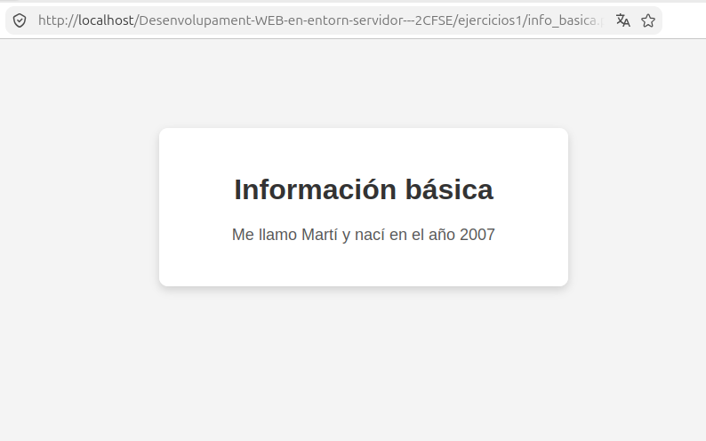
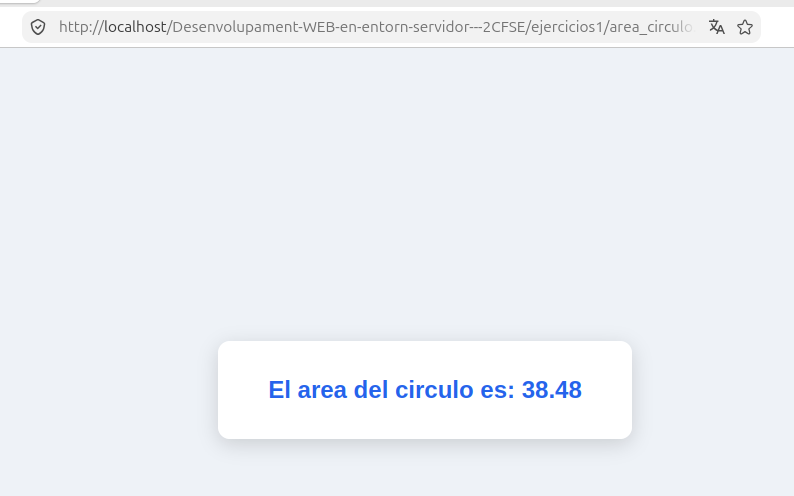
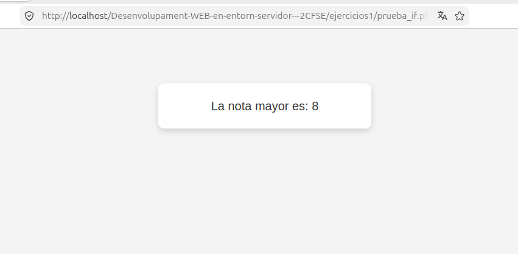
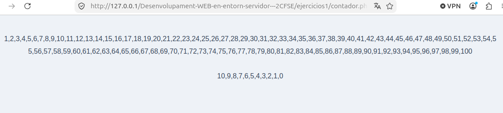
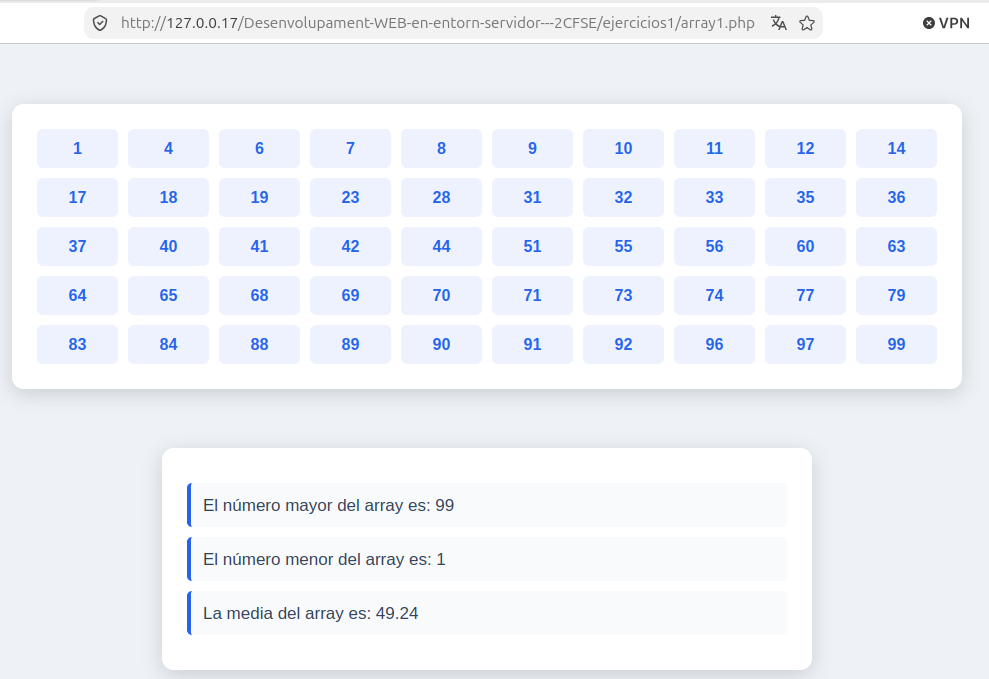

# Ejercicios 1

Ejercicios básicos de PHP realizados durante el módulo de Desarrollo de Aplicaciones en Entorno Servidor.

---

## Ejercicio 1 - Información básica

### Enunciado

Crea un documento llamado `info_basica.php` mostrando tu nombre y tu año de nacimiento mediante variables.

El resultado debe mostrar una frase similar a:

> Me llamo XXXX y nací en el año YYYY.

También se debe comprobar el código fuente generado en el navegador.

### Resultado

---

## Ejercicio 2 - Currículum

### Enunciado

Crea un documento llamado `curriculum.php`.

Utilizando variables variables, muestra una parte de tu currículum, como los estudios realizados y los idiomas hablados, en español, valenciano y otro idioma a elegir.

El idioma seleccionado debe permitir acceder al contenido correspondiente mediante el uso de variables variables.

### Resultado

---

## Ejercicio 3 - Área del círculo

### Enunciado

Crea una página llamada `area_circulo.php`.

Crea una variable `$radio` con el valor `3.5` y, a partir de ella, calcula en otra variable el área del círculo utilizando la fórmula:

> PI × radio²

Se debe definir la constante `PI` y mostrar por pantalla el texto:

> El área del círculo es XX.XX

Donde `XX.XX` será el resultado del cálculo del área.

### Resultado

---

## Ejercicio 4 - Nota mayor

### Enunciado

Crea una página llamada `prueba_if.php` que contenga dos variables, `$nota1` y `$nota2`, con dos notas de examen.

Utilizando una estructura condicional `if/else`, se debe determinar cuál de las dos notas es la mayor.

### Mejora del ejercicio

Se ha ampliado el ejercicio añadiendo una tercera variable, `$nota3`.

Ahora el programa compara las tres notas utilizando estructuras condicionales `if`, `elseif` y `else`, junto con operadores lógicos, para determinar cuál de las tres notas es la mayor.

También se han tenido en cuenta posibles empates entre las notas para evitar resultados incorrectos.

El resultado debe mostrar una frase similar a:

> La nota mayor es: X

### Resultado

---

## Ejercicio 5 - Contador

### Enunciado

Crea una página llamada `contador.php`.

Utilizando una estructura `for`, realiza una cuenta desde el número 1 hasta el 100, mostrando los números separados por comas.

Después, utilizando una estructura `while`, realiza una cuenta desde el número 10 hasta el 0, mostrando los números separados por guiones.

El resultado debe ser similar a:

> 1,2,3,4,5,...,98,99,100

> 10-9-8-7-6-5-4-3-2-1-0

### Mejora del ejercicio

Se ha ampliado el mismo archivo `contador.php` para practicar la intercalación de código HTML y PHP.

Se han añadido elementos HTML fuera de los bloques `<?php ... ?>`, incluyendo un título `<h1>` y párrafos `
` que explican qué realiza cada contador.

De esta forma, la página combina HTML y PHP, utilizando PHP únicamente en las partes necesarias para generar los contadores.

También se han añadido condiciones `if/else` dentro de los bucles para evitar mostrar una coma después del número `100` y un guion después del número `0`.

### Resultado

---

## Ejercicio 6 - Array de números aleatorios

### Enunciado

Crea una página llamada `Array1.php`.

Rellena un array con 50 números aleatorios comprendidos entre `0` y `99` utilizando la función `rand()`.

Después, recorre el array utilizando `foreach` y muestra sus valores mediante una lista HTML `<ul>`.

### Mejoras del ejercicio

Se ha ampliado el ejercicio para realizar diferentes operaciones sobre el array.

Se ha utilizado `in_array()` para comprobar si un número generado ya existe en el array y evitar así números repetidos. El contador del bucle solo aumenta cuando se consigue insertar un nuevo número, garantizando que el array tenga 50 valores diferentes.

También se han realizado las siguientes operaciones:

* Ordenar los números de menor a mayor utilizando `sort()`.
* Obtener el número mayor utilizando `max()`.
* Obtener el número menor utilizando `min()`.
* Calcular la media utilizando `array_sum()` y `count()`.
* Mostrar la media con dos decimales utilizando `number_format()`.

Los valores del array se muestran utilizando un bucle `foreach` y elementos `<li>` generados desde PHP.

### Resultado

