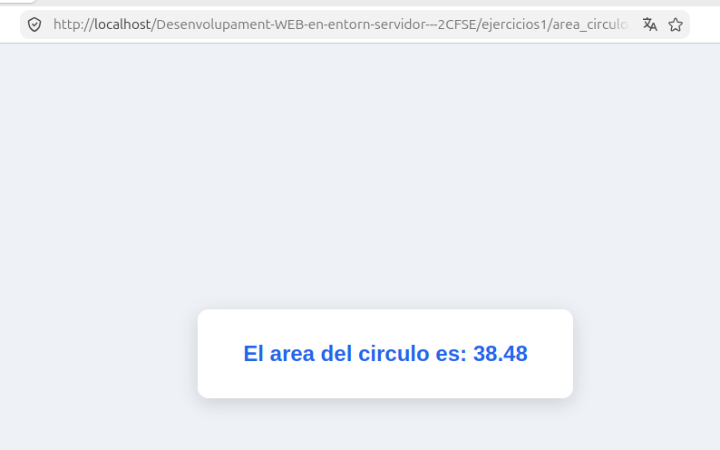
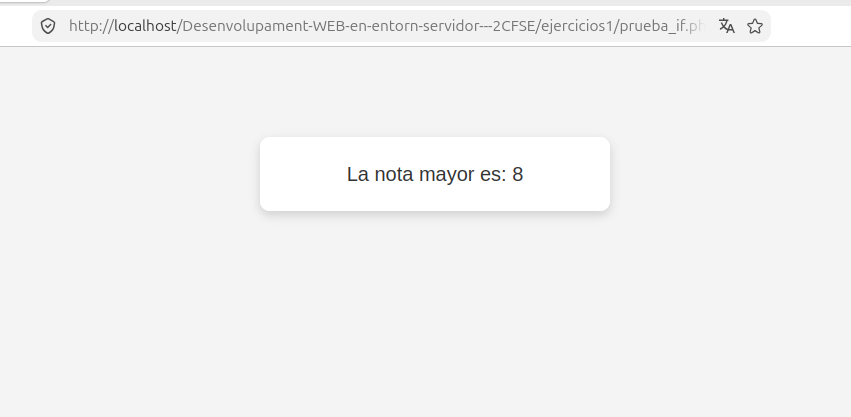
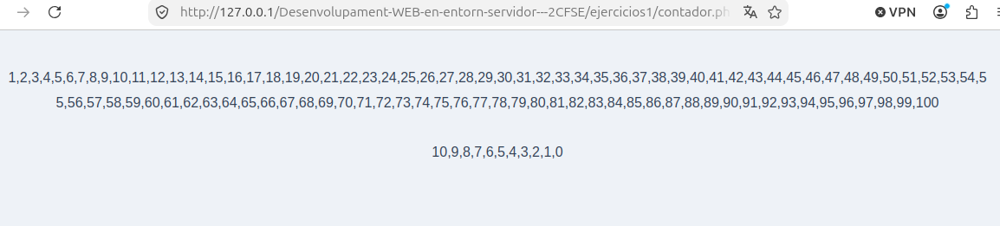
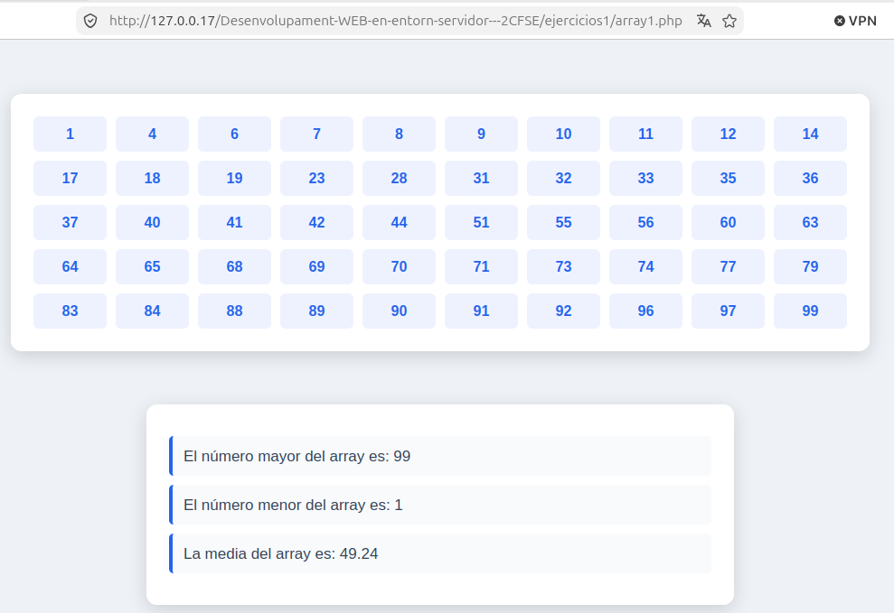
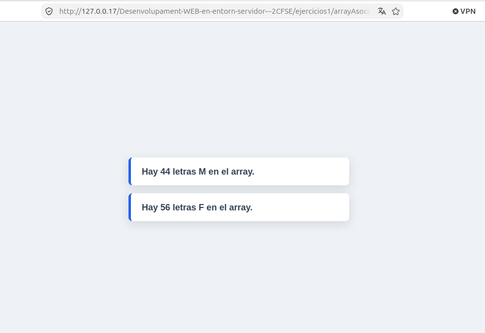
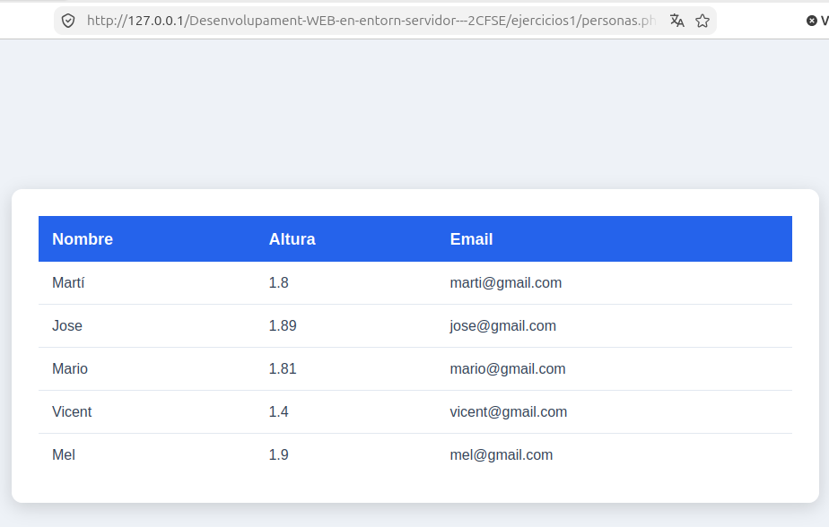

# Ejercicios 1

Ejercicios básicos de PHP realizados durante el módulo de Desarrollo de Aplicaciones en Entorno Servidor.

---

## Ejercicio 1 - Información básica

### Enunciado

Crea un documento llamado `info_basica.php` mostrando tu nombre y tu año de nacimiento mediante variables.

El resultado debe mostrar una frase similar a:

> Me llamo XXXX y nací en el año YYYY.

También se debe comprobar el código fuente generado en el navegador.

### Resultado

---

## Ejercicio 2 - Currículum

### Enunciado

Crea un documento llamado `curriculum.php`.

Utilizando variables variables, muestra una parte de tu currículum, como los estudios realizados y los idiomas hablados, en español, valenciano y otro idioma a elegir.

El idioma seleccionado debe permitir acceder al contenido correspondiente mediante el uso de variables variables.

### Resultado

---

## Ejercicio 3 - Área del círculo

### Enunciado

Crea una página llamada `area_circulo.php`.

Crea una variable `$radio` con el valor `3.5` y, a partir de ella, calcula en otra variable el área del círculo utilizando la fórmula:

> PI × radio²

Se debe definir la constante `PI` y mostrar por pantalla el texto:

> El área del círculo es XX.XX

Donde `XX.XX` será el resultado del cálculo del área.

### Resultado

---

## Ejercicio 4 - prueba_if

### Enunciado

Crea una página llamada `prueba_if.php` que contenga dos variables, `$nota1` y `$nota2`, con dos notas de examen.

Utilizando una estructura condicional `if/else`, se debe determinar cuál de las dos notas es la mayor.

### Mejora del ejercicio

Se ha ampliado el ejercicio añadiendo una tercera variable, `$nota3`.

Ahora el programa compara las tres notas utilizando estructuras condicionales `if`, `elseif` y `else`, junto con operadores lógicos, para determinar cuál de las tres notas es la mayor.

También se han tenido en cuenta posibles empates entre las notas para evitar resultados incorrectos.

El resultado debe mostrar una frase similar a:

> La nota mayor es: X

### Resultado

---

## Ejercicio 5 - Contador

### Enunciado

Crea una página llamada `contador.php`.

Utilizando una estructura `for`, realiza una cuenta desde el número 1 hasta el 100, mostrando los números separados por comas.

Después, utilizando una estructura `while`, realiza una cuenta desde el número 10 hasta el 0, mostrando los números separados por guiones.

El resultado debe ser similar a:

> 1,2,3,4,5,...,98,99,100

> 10-9-8-7-6-5-4-3-2-1-0

### Mejora del ejercicio

Se ha ampliado el mismo archivo `contador.php` para practicar la intercalación de código HTML y PHP.

Se han añadido elementos HTML fuera de los bloques `<?php ... ?>`, incluyendo un título `<h1>` y párrafos `
` que explican qué realiza cada contador.

De esta forma, la página combina HTML y PHP, utilizando PHP únicamente en las partes necesarias para generar los contadores.

También se han añadido condiciones `if/else` dentro de los bucles para evitar mostrar una coma después del número `100` y un guion después del número `0`.

### Resultado

---

## Ejercicio 6 - Array1.php

### Enunciado

Crea una página llamada `Array1.php`.

Rellena un array con 50 números aleatorios comprendidos entre `0` y `99` utilizando la función `rand()`.

Después, recorre el array utilizando `foreach` y muestra sus valores mediante una lista HTML `<ul>`.

### Mejoras del ejercicio

Se ha ampliado el ejercicio para realizar diferentes operaciones sobre el array.

Se ha utilizado `in_array()` para comprobar si un número generado ya existe en el array y evitar así números repetidos. El contador del bucle solo aumenta cuando se consigue insertar un nuevo número, garantizando que el array tenga 50 valores diferentes.

También se han realizado las siguientes operaciones:

* Ordenar los números de menor a mayor utilizando `sort()`.
* Obtener el número mayor utilizando `max()`.
* Obtener el número menor utilizando `min()`.
* Calcular la media utilizando `array_sum()` y `count()`.
* Mostrar la media con dos decimales utilizando `number_format()`.

Los valores del array se muestran utilizando un bucle `foreach` y elementos `<li>` generados desde PHP.

### Resultado

---

## Ejercicio 7 - arrayAsociativo.php

### Enunciado

Crea una página llamada `arrayAsociativo.php`.

Rellena un array de 100 elementos de manera aleatoria con los valores `M` o `F`.

Una vez completado el array, vuelve a recorrerlo y calcula cuántos elementos hay de cada uno de los dos valores.

### Desarrollo

Para rellenar el array se utiliza un bucle `for` que se ejecuta 100 veces.

En cada iteración se genera un número aleatorio entre `0` y `1` mediante `rand()`. Dependiendo del resultado, se almacena `M` o `F` en el array.

Después, se recorre el array utilizando un bucle `foreach` y dos contadores para calcular la cantidad total de valores `M` y `F`.

Finalmente, se muestran por pantalla ambos resultados.

### Resultado

---

## Ejercicio 8 - Personas.php

### Enunciado

Crea una página llamada `Personas.php`.

Mediante un array bidimensional, almacena el nombre, la altura y el email de 5 personas.

Cada persona debe almacenarse mediante un array asociativo utilizando las claves `nombre`, `altura` y `email`.

Posteriormente, recorre el array y muestra todos los datos en una tabla HTML.

### Desarrollo

Se ha creado un array principal llamado `$arrayPersonas` que contiene las cinco personas.

Cada persona se representa mediante un array asociativo formado por las claves `nombre`, `altura` y `email`.

Para recorrer el array principal se utiliza un bucle `for`. Dentro de cada iteración se utiliza un `foreach` para recorrer los valores almacenados en el array asociativo correspondiente a cada persona.

Los datos se muestran mediante una tabla HTML:

* `<table>` contiene la tabla completa.
* `<tr>` representa cada fila.
* `<th>` se utiliza para los encabezados Nombre, Altura y Email.
* `<td>` se utiliza para mostrar cada uno de los datos de las personas.

De esta forma, cada persona ocupa una fila de la tabla y cada uno de sus datos ocupa una celda.

### Resultado

---

## Ejercicio 9 - Garaje.php

### Enunciado

Crea una página llamada `coches.php`.

Define un array bidimensional mixto donde la primera dimensión sea asociativa y utilice las matrículas de los coches como claves.

La segunda dimensión será numérica y almacenará los datos de cada coche de la siguiente forma:

* Posición `0`: marca.
* Posición `1`: modelo.
* Posición `2`: número de puertas.

El array debe contener al menos 3 o 4 coches.

Finalmente, se debe recorrer el array y mostrar los datos de los coches ordenados por matrícula.

### Desarrollo

Se ha creado un array principal llamado `$arrayCoches`.

Las matrículas se utilizan como claves asociativas del array principal y cada matrícula contiene un segundo array numérico con la marca, el modelo y el número de puertas del coche.

Por ejemplo, la estructura utilizada es similar a:

`$arrayCoches["1A"] = ["Ford", "Focus", 5];`

Para ordenar los coches por matrícula se utiliza la función `ksort()`, ya que las matrículas corresponden a las claves del array asociativo.

Después, se utiliza un bucle `foreach` para recorrer todos los coches. En cada iteración, la clave representa la matrícula y el valor contiene el array con los datos del vehículo.

Dentro del `foreach` se utiliza un bucle `for` para recorrer las tres posiciones del array de cada coche:

* Posición `0`: se muestra la marca.
* Posición `1`: se muestra el modelo.
* Posición `2`: se muestra el número de puertas.

Finalmente, se muestran de forma separada la matrícula, la marca, el modelo y el número de puertas de cada vehículo.

### Resultado

---

## Ejercicio 10 - arrayBidimensional.php

### Enunciado

Crea una página llamada `arrayBidimensional.php`.

Rellena un array bidimensional de 6 filas por 9 columnas con números aleatorios comprendidos entre `100` y `999`, ambos incluidos.

Todos los números almacenados en el array deben ser distintos, por lo que no se puede repetir ningún valor.

Finalmente, se debe mostrar el contenido del array teniendo en cuenta las siguientes condiciones:

* La columna donde se encuentra el número máximo debe aparecer en azul.
* La fila donde se encuentra el número mínimo debe aparecer en verde.
* El resto de números deben aparecer en negro.

### Desarrollo

Se ha creado un array bidimensional llamado `$arrayBi` de 6 filas y 9 columnas.

Para rellenarlo se utilizan dos bucles `for` anidados. En cada posición se genera un número aleatorio entre `100` y `999` mediante `rand()`.

Antes de introducir cada número en el array, se recorren las filas ya creadas y se utiliza `in_array()` para comprobar si el número ya existe. Si está repetido, se vuelve a generar el valor de esa posición hasta conseguir un número diferente.

Una vez rellenado el array, se obtiene el número máximo de cada fila mediante `max()` y se almacenan los resultados en `$arrayMax`. Posteriormente, se utiliza de nuevo `max()` para obtener el número máximo de todo el array.

El mismo procedimiento se realiza utilizando `min()` para obtener el número mínimo de todo el array.

Después, se recorren las filas y columnas del array para localizar:

* La columna en la que se encuentra el número máximo, almacenándola en `$colMax`.
* La fila en la que se encuentra el número mínimo, almacenándola en `$filaMin`.

Finalmente, el array se muestra mediante una tabla HTML generada con dos bucles `for`.

Durante la creación de las celdas se comprueba su posición:

* Si la celda pertenece a la columna del máximo, se muestra en azul.
* Si pertenece a la fila del mínimo, se muestra en verde.
* El resto de celdas se muestran en negro.

### Resultado

