# Ejercicios PHP 2 - Uso de Funciones

## Ejercicio 1 - contador.php

Creamos una función `cuenta($a, $b)` que recibe dos números y muestra todos los números comprendidos entre ambos separados por comas.

En este caso probamos la función contando del 10 al 20.

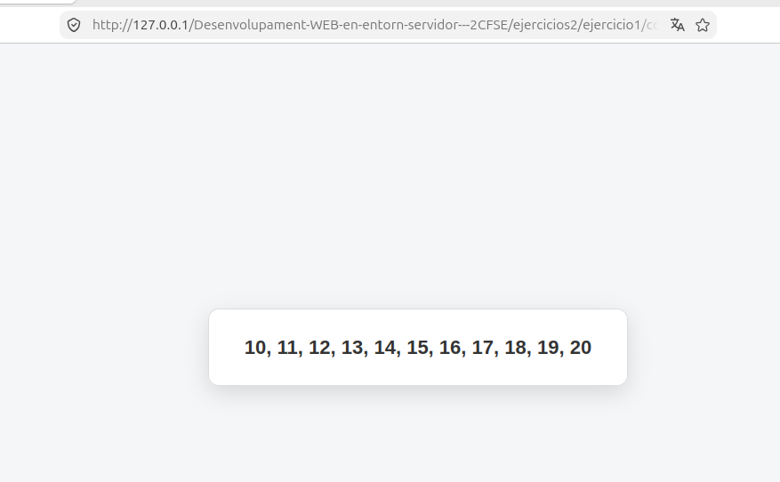

---

## Ejercicio 2 - intercambia.php

Creamos una función `intercambia()` que recibe dos variables por referencia e intercambia sus valores.

Después mostramos los valores por pantalla para comprobar que se han intercambiado correctamente.

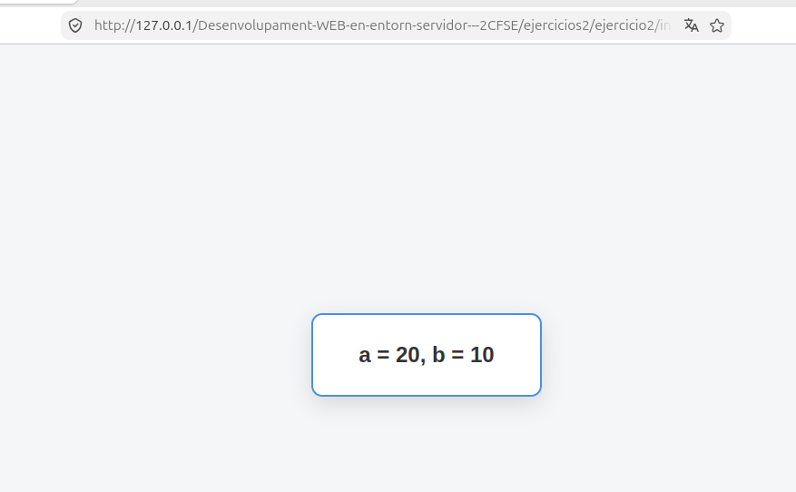

---

## Ejercicio 3 - parametrosVariables.php

Creamos una función que puede recibir una cantidad variable de números mediante `func_get_args()`.

Recorremos los números recibidos para encontrar cuál es el mayor sin utilizar la función `max()`.

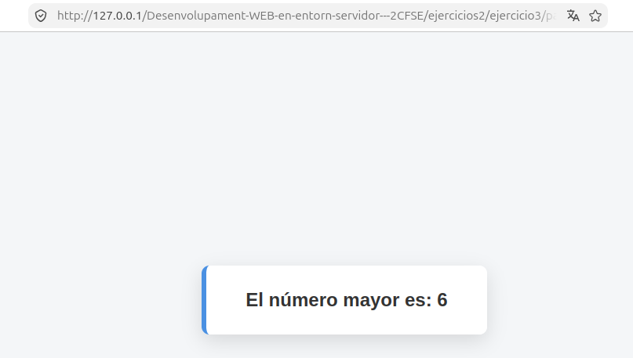

---

## Ejercicio 4 - comprueba_hora.php

Creamos una variable que contiene una hora en formato `hora:minutos:segundos`.

Utilizamos `explode()` para separar la hora en sus diferentes partes y comprobamos que las horas, minutos y segundos estén dentro de los valores permitidos.

Finalmente mostramos por pantalla si la hora introducida es válida o no.

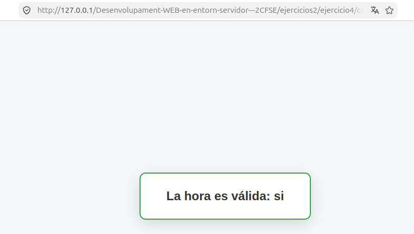

---

## Ejercicio 5 - matematicas.php

Creamos varias funciones para trabajar con los dígitos de un número:

- `digitos()` devuelve el número de dígitos.
- `digitoN()` devuelve el dígito que se encuentra en una determinada posición.
- `quitaPorDetras()` elimina una cantidad determinada de dígitos por detrás.
- `quitaPorDelante()` elimina una cantidad determinada de dígitos por delante.

Para realizar las operaciones utilizamos funciones de cadenas como `strlen()` y `substr()`.

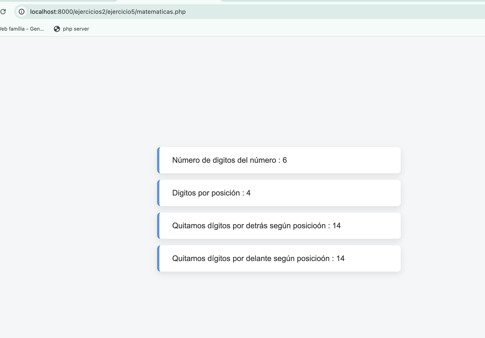

---

## Ejercicio 6 - Login

Creamos un sistema de login formado por varios archivos:

- `login.php` contiene el formulario de usuario y contraseña.
- `compruebaLogin.php` recibe los datos mediante `POST` y comprueba las credenciales utilizando un array asociativo.
- `ok.php` se incluye cuando el usuario y la contraseña son correctos.
- `ko.php` se incluye cuando las credenciales son incorrectas e indica si el error está en la contraseña o si usuario y contraseña son incorrectos.

En caso de error se vuelve a mostrar el formulario para que el usuario pueda intentarlo de nuevo.

### Login incorrecto

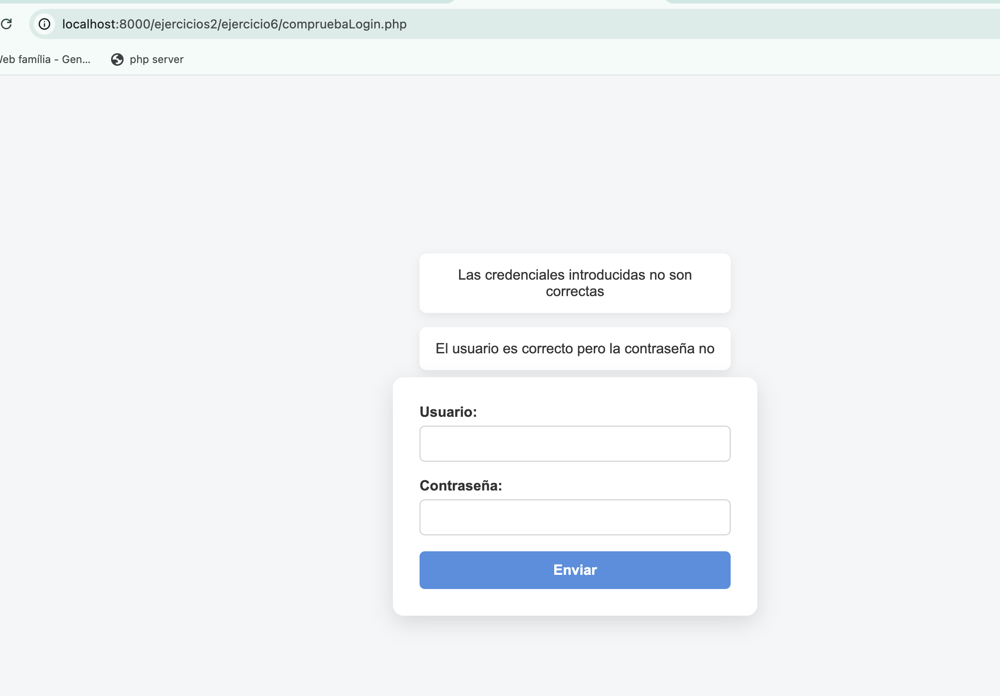

### Login correcto

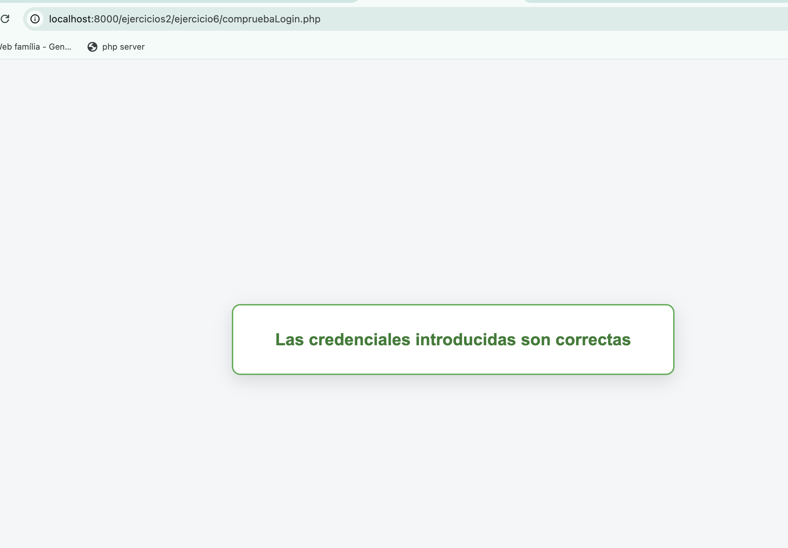

---

## Ejercicio 7 - fraseImpares.php

Creamos una función que recibe una frase y devuelve una nueva frase formada únicamente por los caracteres que se encuentran en posiciones impares.

Para ello recorremos la frase carácter a carácter utilizando `strlen()` y comprobamos si cada posición es impar mediante el operador módulo `%`.

Los caracteres que se encuentran en posiciones impares se van concatenando para formar la nueva frase.

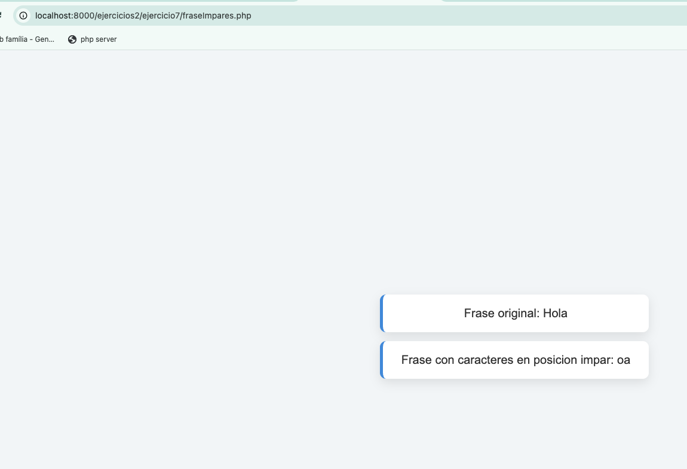

---

## Ejercicio 8 - analizador.php

Creamos un analizador que recibe una frase formada por palabras separadas por espacios.

Utilizamos `explode()` para separar la frase en un array de palabras y `count()` para obtener el número total de palabras.

Después recorremos el array y utilizamos `strlen()` para calcular el número total de letras de la frase y mostrar también el tamaño de cada palabra.

Todo el ejercicio se realiza sin utilizar la función `str_word_count()`.

---

## Ejercicio 9 - analizadorWC.php

Volvemos a realizar el analizador de frases del ejercicio anterior, pero esta vez utilizando la función `str_word_count()`.

Utilizamos `str_word_count($frase)` para obtener directamente el número total de palabras y `str_word_count($frase, 1)` para obtener un array con todas las palabras de la frase.

Después recorremos el array utilizando `strlen()` para calcular el número total de letras y mostrar el tamaño de cada palabra.

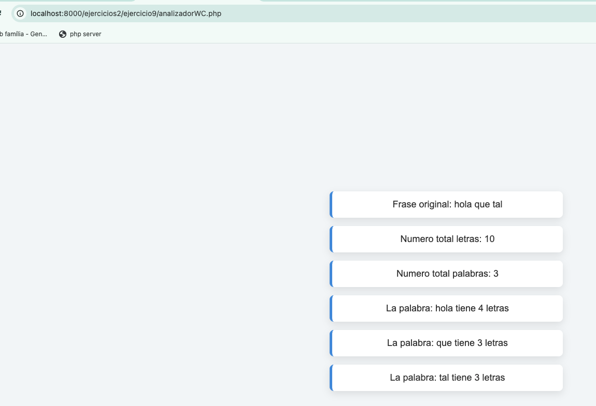

---

## Ejercicio 10 - cani.php

Creamos una transformación de una frase al estilo "cani", alternando sus caracteres entre minúsculas y mayúsculas.

Utilizamos `str_word_count($frase, 1)` para obtener las palabras de la frase y recorremos cada palabra carácter a carácter.

Mediante una función `isImpar()` comprobamos la posición de cada carácter y utilizamos `strtoupper()` y `strtolower()` para alternar entre mayúsculas y minúsculas.

La alternancia comienza de nuevo en cada palabra y posteriormente añadimos los espacios para reconstruir la frase.

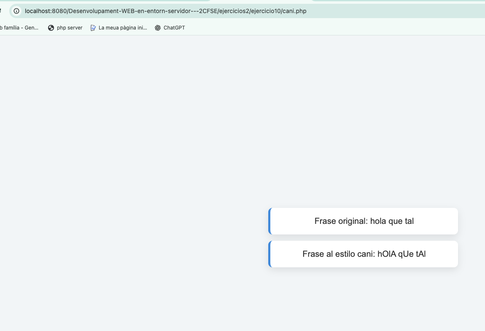

---

## Ejercicio 11 - palindromo.php

Comprobamos si una palabra o frase es un palíndromo, es decir, si se lee igual de izquierda a derecha que de derecha a izquierda.

Utilizamos `str_word_count($frase, 1)` para separar las palabras y las concatenamos para obtener la frase sin espacios. También utilizamos `strtolower()` para trabajar con los caracteres en minúsculas.

Después recorremos la frase desde el último carácter hasta el primero para construir la frase invertida.

Finalmente comparamos ambas cadenas y mostramos por pantalla si la frase es palíndroma o no.

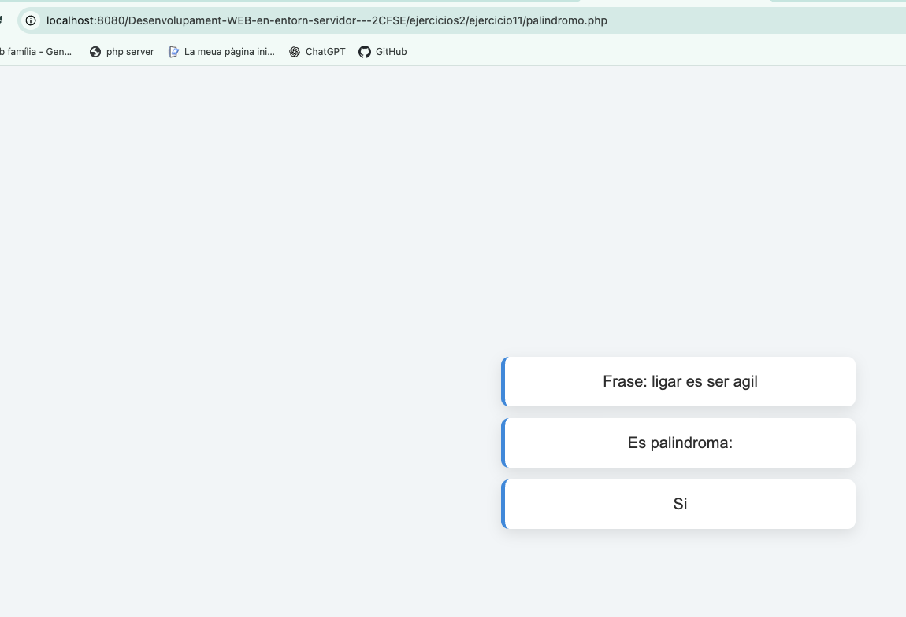