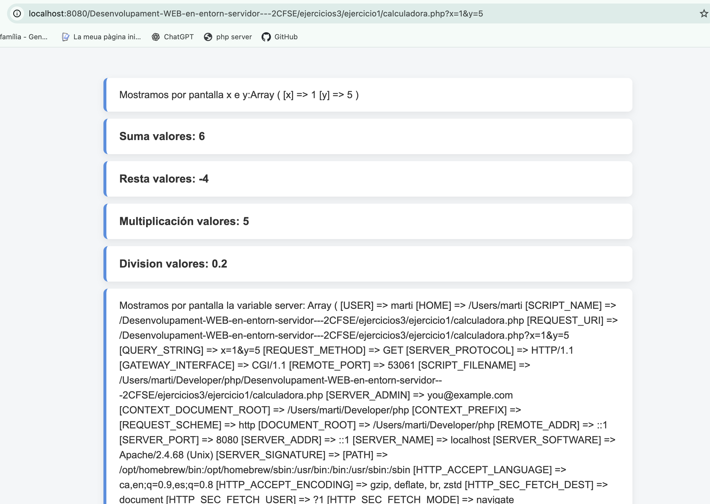
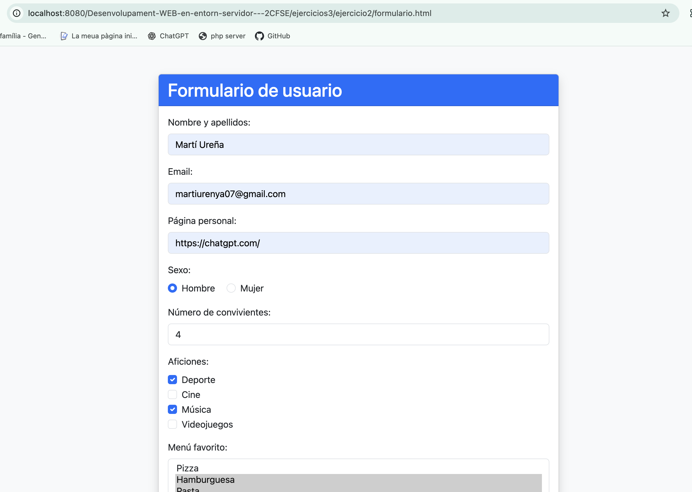
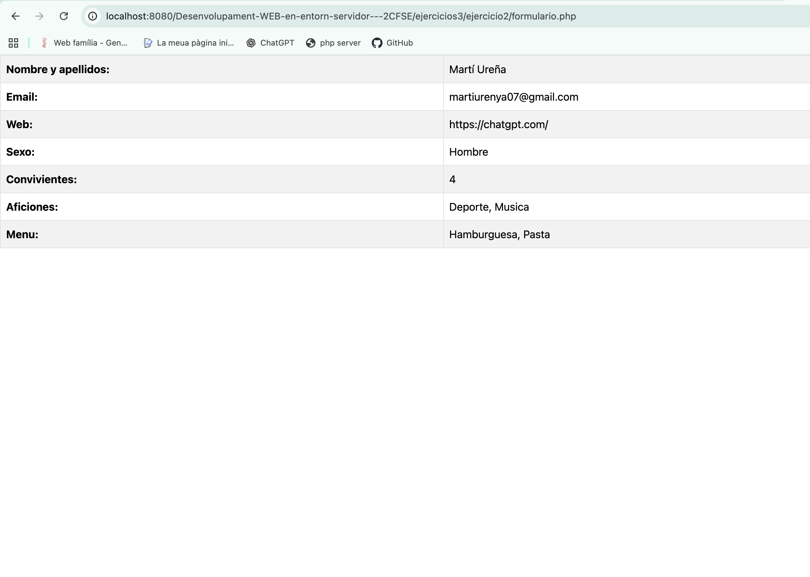

# PHP - Trabajando con Formularios

## Ejercicio 1 - calculadora.php

Creamos una calculadora que recibe los valores `x` e `y` mediante parámetros enviados por la URL utilizando el método `GET`.

Recogemos los valores mediante el array asociativo `$_GET` y realizamos las operaciones de suma, resta, multiplicación y división.

También utilizamos `$_SERVER` para obtener información sobre la petición, como la dirección del ordenador que realiza la petición mediante `REMOTE_ADDR`, los parámetros de la URL mediante `QUERY_STRING` y la ruta local del servidor mediante `DOCUMENT_ROOT`.

Separamos la lógica de la presentación utilizando dos archivos: `calculadora.php` realiza los cálculos y prepara las variables, mientras que `calculadora.view.php` se encarga de mostrar los resultados.

---

## Ejercicio 2 - formulario.html y formulario.php

Creamos un formulario utilizando Bootstrap para recoger diferentes datos del usuario y enviarlos mediante el método `POST` a `formulario.php`.

El formulario permite introducir el nombre y apellidos, email, página personal, sexo y número de convivientes.

También utilizamos campos múltiples para seleccionar diferentes aficiones mediante `checkbox` y diferentes menús favoritos mediante un `select` múltiple. Utilizamos `[]` en el atributo `name` para recibir estas selecciones como arrays en PHP.

En `formulario.php` recogemos los datos mediante `$_POST`. Para los campos múltiples utilizamos `isset()` para comprobar que han sido enviados y recorremos sus arrays para mostrar las opciones seleccionadas.

Finalmente mostramos todos los datos recibidos en una tabla resumen utilizando Bootstrap.

### Formulario

### Tabla resumen

