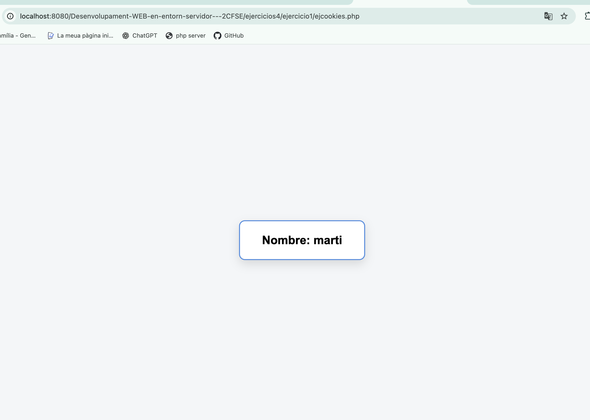

# PHP - Cookies y Sesiones

Ejercicios realizados sobre el uso de cookies y sesiones en PHP.

## Ejercicio 1 - Cookies

Creamos una aplicación que comprueba si existe una cookie llamada `user`.

Si la cookie no existe, utilizamos `setcookie()` para crearla y guardar nuestro nombre durante 1000 segundos. Para establecer correctamente el tiempo de caducidad utilizamos `time() + 1000`.

En las siguientes peticiones podemos acceder al valor almacenado mediante el array asociativo `$_COOKIE` y mostrar el nombre guardado en el navegador.

Funciones y conceptos utilizados:

- `$_COOKIE`
- `isset()`
- `setcookie()`
- `time()`
- Caducidad de cookies

### Resultado

