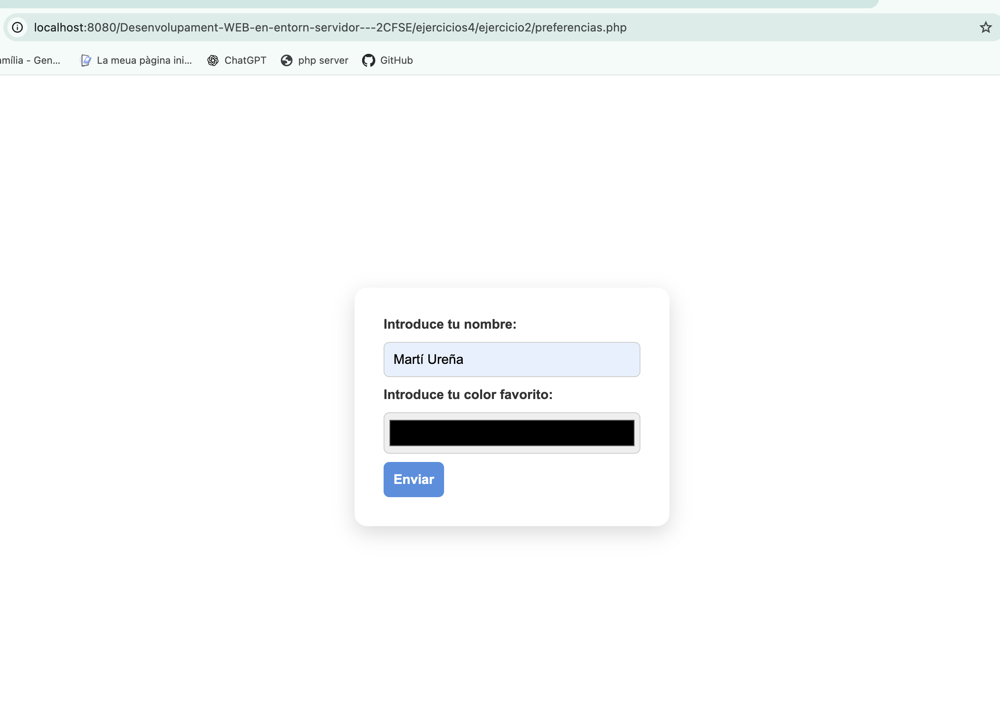
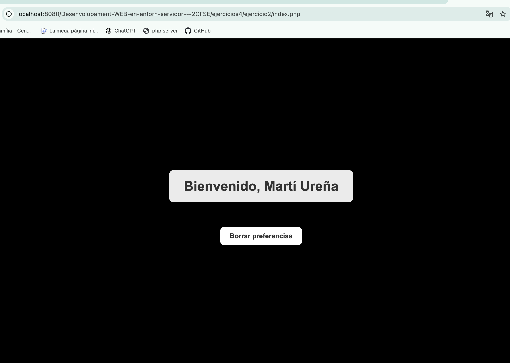
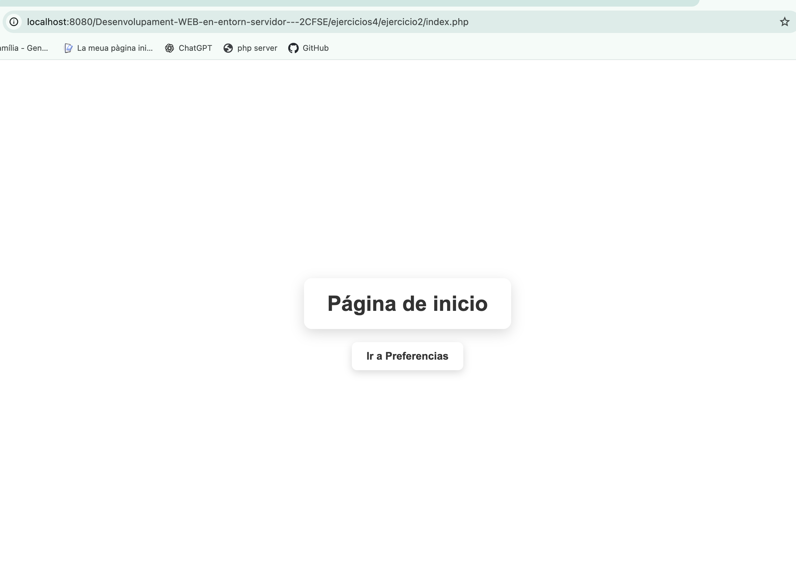
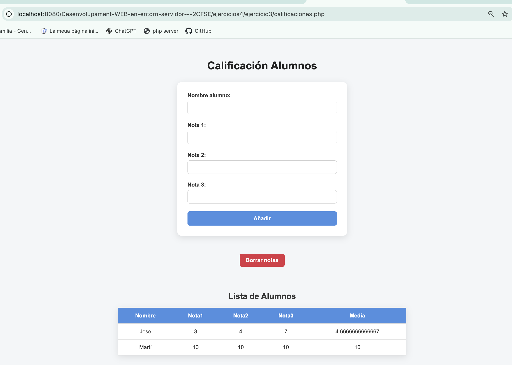
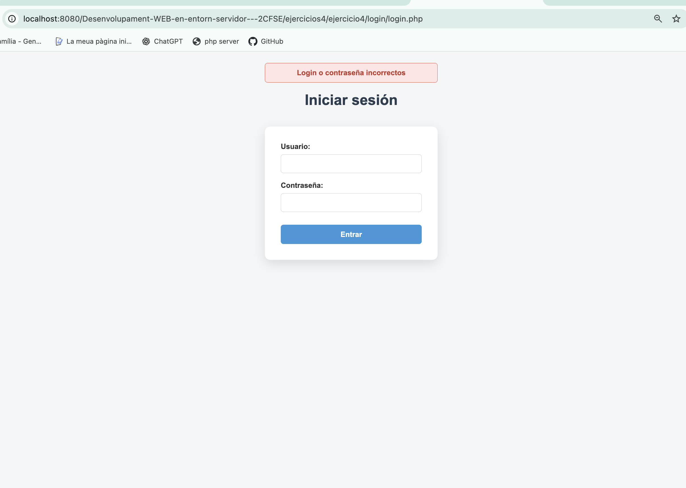
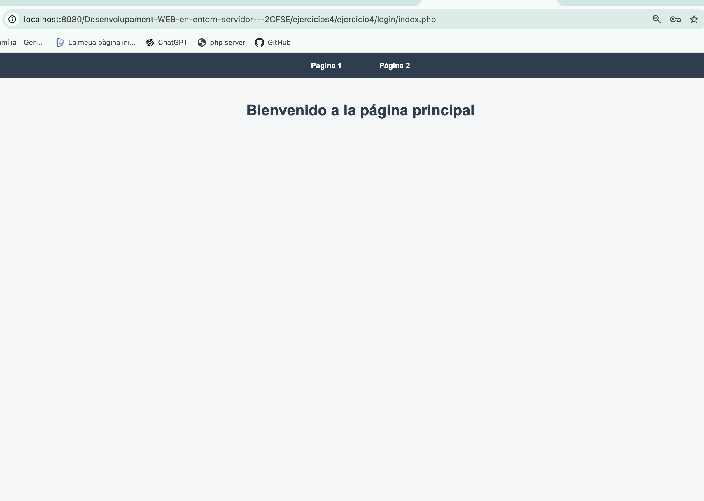
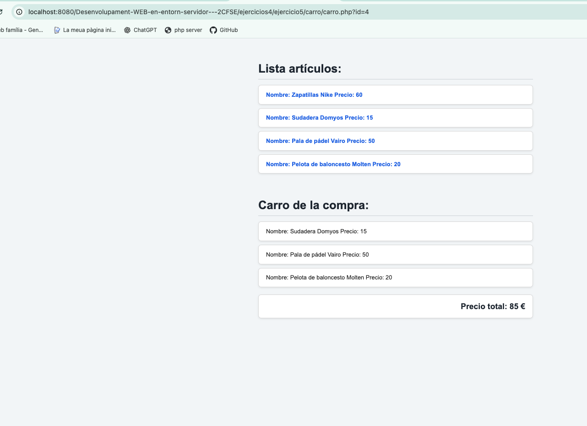

# PHP - Cookies y Sesiones

Ejercicios realizados sobre el uso de cookies y sesiones en PHP.

## Ejercicio 1 - Cookies

Creamos una aplicación que comprueba si existe una cookie llamada `user`.

Si la cookie no existe, utilizamos `setcookie()` para crearla y guardar nuestro nombre durante 1000 segundos. Para establecer correctamente el tiempo de caducidad utilizamos `time() + 1000`.

En las siguientes peticiones podemos acceder al valor almacenado mediante el array asociativo `$_COOKIE` y mostrar el nombre guardado en el navegador.

Funciones y conceptos utilizados:

- `$_COOKIE`
- `isset()`
- `setcookie()`
- `time()`
- Caducidad de cookies

### Resultado


---

## Ejercicio 2 - Preferencias con cookies

Creamos una aplicación que permite guardar las preferencias de un usuario utilizando cookies.

En `preferencias.php` mostramos un formulario donde el usuario introduce su nombre y selecciona su color favorito.

Los datos se envían mediante `POST` a `guarda_prefs.php`, donde recogemos el nombre y el color y los almacenamos en dos cookies con una duración de 5 minutos. Después utilizamos `header()` para redirigir al usuario a `index.php`.

En `index.php` comprobamos mediante `isset()` si existen las cookies. Si existen, mostramos un mensaje de bienvenida con el nombre del usuario y utilizamos el color almacenado como fondo de la página. Si no existen, mostramos la página de inicio con fondo blanco y un enlace para configurar las preferencias.

También creamos `borrar_prefs.php`, que elimina las cookies estableciendo una fecha de caducidad pasada y redirige de nuevo a la página principal.

Funciones y conceptos utilizados:

- `$_POST`
- `$_COOKIE`
- `isset()`
- `setcookie()`
- `time()`
- `header()`
- Creación y eliminación de cookies
- Redirecciones
- Uso de valores almacenados en cookies

### Formulario de preferencias



### Página con preferencias guardadas



### Página sin preferencias



---

## Ejercicio 3 - Calificación de alumnos con sesiones

Creamos una aplicación para gestionar las calificaciones de los alumnos del módulo de DWES utilizando sesiones.

Mediante un formulario introducimos el nombre del alumno y las notas de los tres trimestres. Los datos enviados mediante `POST` se guardan en un array asociativo que representa a cada alumno.

Los alumnos se almacenan dentro de `$_SESSION["alumnos"]`. Utilizamos `[]` para añadir automáticamente cada nuevo alumno a la siguiente posición del array sin necesidad de utilizar un contador.

Después recorremos los alumnos almacenados mediante un `foreach` y mostramos en una tabla el nombre, las tres notas y la media calculada de cada alumno.

También añadimos un enlace para borrar las notas. El enlace envía el parámetro `borrar` mediante `GET`. Comprobamos su existencia con `isset()` y utilizamos `unset()` para eliminar únicamente `$_SESSION["alumnos"]`.

Funciones y conceptos utilizados:

- `session_start()`
- `$_SESSION`
- `$_POST`
- `$_GET`
- `isset()`
- `unset()`
- Arrays asociativos
- Añadir elementos mediante `$array[]`
- `foreach`
- Almacenamiento de datos entre peticiones mediante sesiones
- Cálculo de la media de las notas

### Calificación de alumnos



---

## Ejercicio 4 - Login con sesiones

Creamos un pequeño sistema de login utilizando sesiones y un archivo de texto con los usuarios y contraseñas permitidos.

En `usuarios.txt` almacenamos varios usuarios y contraseñas separados mediante `:`. Desde `login.php` mostramos un formulario donde el usuario introduce su login y contraseña.

Cuando se envía el formulario, abrimos `usuarios.txt` con `fopen()` y recorremos su contenido utilizando `fgetcsv()` con `:` como separador. Comparamos cada usuario y contraseña del archivo con los datos recibidos mediante `POST`.

Si los datos son correctos, guardamos el login del usuario en:

```php
$_SESSION["loginusu"] = $usuario;
```

Después utilizamos `header()` para redirigir al usuario a `index.php`.

Si no encontramos ninguna coincidencia en el archivo, mostramos de nuevo el formulario indicando que el login o la contraseña son incorrectos.

También creamos `cabecera.inc`, que comprueba si existe `$_SESSION["loginusu"]`. Si no existe, redirige al usuario a `login.php`, evitando que pueda acceder directamente a las páginas protegidas.

Las páginas `index.php`, `pag1.php` y `pag2.php` utilizan `require()` para cargar `cabecera.inc`. De esta forma reutilizamos la comprobación de la sesión y el menú de navegación sin repetir el mismo código en todas las páginas.

Funciones y conceptos utilizados:

- `session_start()`
- `$_SESSION`
- `$_POST`
- `isset()`
- `fopen()`
- `fgetcsv()`
- `feof()`
- `fclose()`
- `header()`
- `exit()`
- `require()`
- Lectura de archivos de texto
- Login mediante usuario y contraseña
- Protección de páginas mediante sesiones
- Reutilización de código mediante archivos `.inc`

### Login



### Página principal después de iniciar sesión



---

## Ejercicio 5 - Carro de la compra con sesiones

Creamos un pequeño carro de la compra utilizando sesiones para almacenar los artículos seleccionados y mantener el precio total entre diferentes peticiones.

Partimos de un array multidimensional que contiene los artículos disponibles. Cada artículo está representado mediante un array asociativo con su `id`, `nombre` y `precio`.

Recorremos el array mediante un `foreach` y mostramos cada artículo como un enlace. Al pulsar sobre uno de ellos enviamos su `id` mediante `GET` a la propia página `carro.php`.

Cuando recibimos el `id`, buscamos el artículo correspondiente recorriendo el array de artículos. Una vez encontrado, lo añadimos al carrito almacenado en sesión utilizando:

```php
$_SESSION["articulos"][] = $articulo;
```

El uso de `[]` permite añadir automáticamente cada nuevo artículo a la siguiente posición del array sin necesidad de utilizar un contador.

También almacenamos en `$_SESSION["precio_total"]` el importe total del carrito. Antes de empezar a utilizarlo comprobamos si existe y, solamente si todavía no existe, lo inicializamos a `0`:

```php
if (!isset($_SESSION["precio_total"])) {
    $_SESSION["precio_total"] = 0;
}
```

De esta forma evitamos que el precio total vuelva a cero cada vez que se carga la página.

Cada vez que añadimos un artículo acumulamos su precio:

```php
$_SESSION["precio_total"] += $articulo["precio"];
```

Finalmente recorremos `$_SESSION["articulos"]` mediante un `foreach` para mostrar todos los productos añadidos al carrito y mostramos el precio total acumulado.

Funciones y conceptos utilizados:

- `session_start()`
- `$_SESSION`
- `$_GET`
- `isset()`
- Arrays asociativos
- Arrays multidimensionales
- Añadir elementos mediante `$array[]`
- `foreach`
- Parámetros enviados mediante enlaces y `GET`
- Almacenamiento de arrays en una sesión
- Acumulación de valores en una sesión
- Inicialización de variables de sesión solamente cuando no existen

### Carro de la compra

